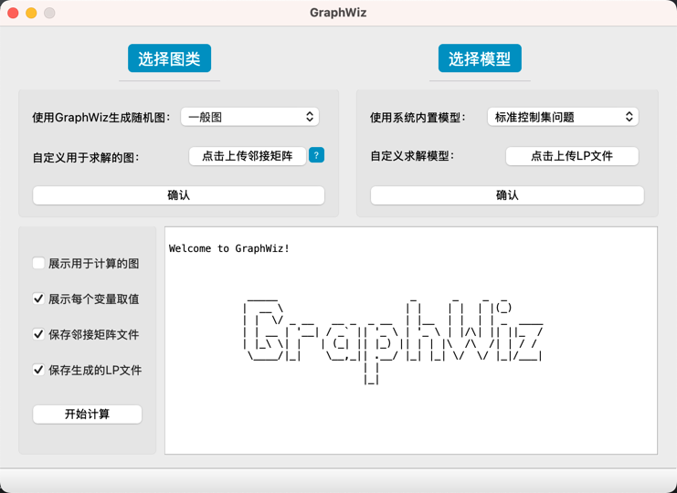
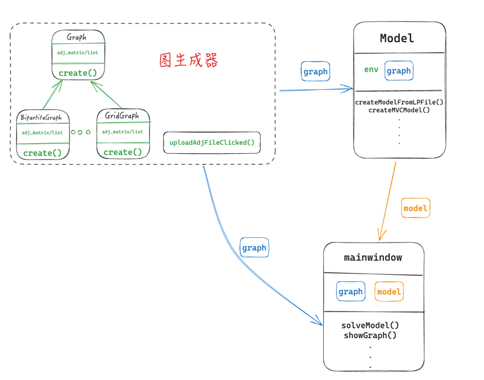

### GraphWiz

生成图算法和求解图的一些问题的整数规划算法



#### 主要功能
- 生成图：目前可以生成一般图、二部图、树、网格图、区间图、仙人掌图、块图等，生成的图可以用于项目内部计算，也可以保存邻接矩阵文件。
- 上传图的邻接矩阵文件用于计算。
- 上传LP文件求解图的一些问题。
- 使用项目内的模型进行计算，目前可以求解标准控制集问题、独立集问题、定点覆盖问题、完美双罗马控制集问题，模型可以保存为LP文件。
- 展示计算结果：最优解、每个变量的取值

### 编译运行

#### 依赖项
- CMake：至少版本 3.28。
- C++ 编译器：支持 C++17 标准。
- Qt5：需要安装 Qt5 库及其开发头文件（Core, Gui, Widgets 模块）。
- Gurobi：需要安装 Gurobi 优化库及其开发头文件。（通过学生认证，不然当图的定点数较多时，免费版本无法计算那么大的模型）

#### 本地编译
需要修改 CMakeLists.txt 文件中的 Gurobi、QT5 相关路径。
```shell
git clone
cd GraphWiz
mkdir build
cd build
cmake ..
make
./GraphWiz
```
### 组件图

