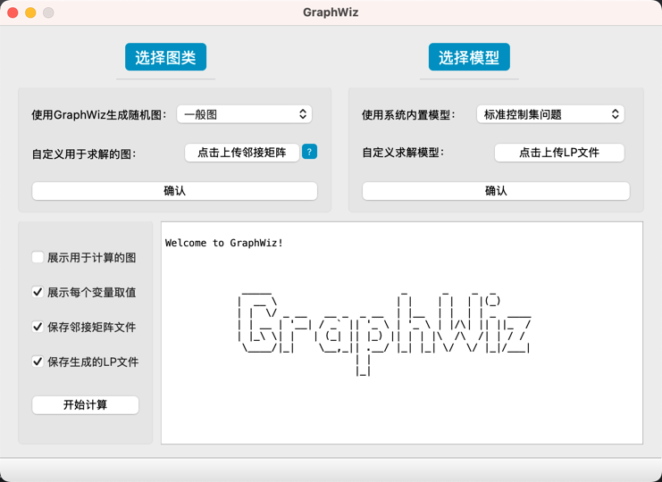
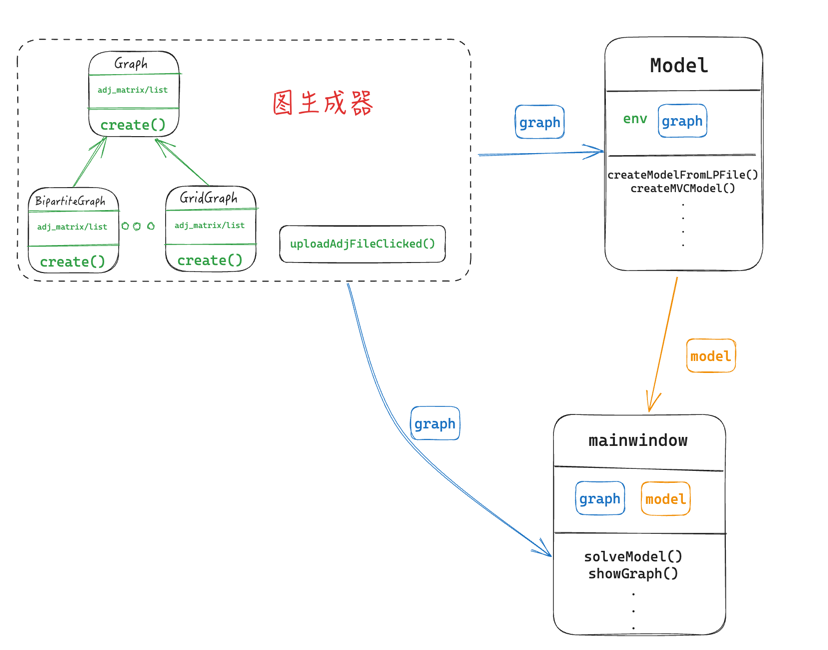

# GraphWiz

一个结合了**过程式图生成 (Procedural Graph Generation)**与**精确整数线性规划 (ILP) 求解器**的交互式 Qt/C++ 桌面应用程序。

[](./LICENSE)
[](https://en.cppreference.com/w/cpp/17)
[](https://www.qt.io/)
[](https://www.gurobi.com/)

[**English Version**](./README.md) | [**算法与数学模型指南**](./doc/ALGORITHMS_zh.md) | [**开发者与二次开发指南**](./doc/DEVELOPER_GUIDE_zh.md)

---



---

## 为什么选择 GraphWiz？

在图论和运筹学研究中，研究人员和学生经常面临零散且繁琐的工作流：在一个脚本中生成特定的图拓扑结构、导出文件，然后在另一种编程语言中编写整数规划模型，最后再读入求解器计算。

**GraphWiz** 将这一完整的流水线整合进了一个直观的 GUI 应用程序中：
1. **生成 (Generate)**：即时生成具有各种复杂拓扑特征的过程式图结构（例如块图、仙人掌图、区间图、网格图等），支持自定义顶点规模。
2. **建模 (Formulate)**：自动将经典和前沿的组合优化问题（如支配集、顶点覆盖等）映射到当前生成的图上，一键构建严格的数学规划模型。
3. **求解与分析 (Solve & Analyze)**：利用行业顶尖的 **Gurobi Optimizer** 进行实时精确求解，在程序内置的日志控制台中直观地审查决策变量取值、最优目标值、求解耗时和求解状态。

---

## 核心功能

### 1. 过程式图拓扑生成
GraphWiz 支持生成 8 种不同的图拓扑类型，具有高度灵活的顶点和边分布：
- **一般图 (Common Graph)**：标准的随机图生成（基于 Erdős-Rényi 机制）。
- **二部图 (Bipartite Graph)**：生成两个独立的顶点子集 $X$ 和 $Y$，保证各子集内部无边连接。
- **网格图 (Grid Graph)**：根据行数和列数生成标准的 2D 网格结构。
- **树图 (Tree Graph)**：通过随机父节点关联，生成无环的连通树结构。
- **区间图 (Interval Graph)**：基于带随机权重的重叠区间段特征生成对应的区间图。
- **块图 (Block Graph)**：由多个全连接的子图（块）通过割点（Cut-vertices）拼接而成的连通图。
- **仙人掌图 (Cactus Graph)**：任意两个简单环至多共享一个顶点的特殊连通图。
- **块-仙人掌图 (Block-Cactus Graph)**：结合了块图和仙人掌图特征的混合图结构。

### 2. 内置整数线性规划 (ILP) 模型
支持直接对当前生成的图结构求解以下经典的图组合优化问题：
- **标准支配集问题 (DP)**：寻找最小的顶点集合，使得不属于该集合的所有顶点都至少与该集合中的一个顶点相邻。
- **最小顶点覆盖问题 (MVC)**：选择最小的顶点集合，使得图中的每一条边都至少有一个端点属于该集合。
- **最大独立集问题 (MIS)**：寻找包含顶点数最多的集合，使得集合中任意两个顶点在图中都不相邻。
- **完美双罗马支配集问题 (PDRDP)**：求解一种更复杂的、带多重资源约束的罗马支配变体问题。

### 3. 通用 LP 文件求解
如果您已经有了外部的数学规划模型，GraphWiz 提供了通用的 LP 求解接口。您可以直接上传外部的标准 `.lp` 或 `.mps` 格式的数学规划文件，程序将调用底层的 Gurobi 引擎进行求解并实时输出计算日志。

---

## 架构概览

GraphWiz 遵循高内聚、低耦合的面向对象设计原则进行开发：

- **图生成工厂与多态继承**：拥有一个抽象基类 `Graph`，各个特殊的图拓扑结构（如 `CactusGraph`）继承自该类并实现多态。针对块图和仙人掌图的混合，采用 C++ 虚继承（Virtual Inheritance）解决了经典的菱形继承问题。
- **解耦的优化桥接器**：`Model` 类作为工厂方法，将图拓扑数据转换为 Gurobi C++ 变量及约束，完全避免了图生成逻辑与数学规划库的强耦合。
- **GUI 与流重定向**：基于 Qt 编写，通过自定义的 `LogStream` 将标准的 C++ 控制台输出实时重定向到 GUI 面板，免去开发者调试日志的痛苦。

```
                    ┌────────────────────────┐
                    │      MainWindow        │ (Qt GUI 视图)
                    └───────────┬────────────┘
                                │
               ┌────────────────┴────────────────┐
               ▼                                 ▼
   ┌───────────────────────┐         ┌───────────────────────┐
   │       Graph           │         │         Model         │ (ILP 模型工厂)
   │     (抽象基类)        │         │   (解耦的求解器接口)  │
   └───────────┬───────────┘         └───────────┬───────────┘
               │                                 │
     ┌_________┼_________┐                       │ (调用 Gurobi C++ API)
     ▼         ▼         ▼                       ▼
Common...    Block     Cactus      ┌───────────────────────────┐
                      ▲   ▲        │     Gurobi Optimizer      │
                      └───┴────────┤ (GRBEnv, GRBModel 依赖)   │
                     虚继承        └───────────────────────────┘
                  (解决菱形继承)
```

### 核心类与组件关系图


---

## 快速开始

### 开发环境依赖

在本地编译和运行 GraphWiz 之前，请确保您的系统中已安装：
- **C++ 编译器**：支持 C++17 或更高标准（如 GCC 9+, Clang 10+, 或 MSVC 2019+）。
- **CMake**：最低版本 `3.28`。
- **Qt5 SDK**：需安装 `Core`、`Gui` 和 `Widgets` 模块。
- **Gurobi Optimizer**：需在本地安装并激活（推荐使用学术/学生许可证，因为免费评估版存在模型变量数限制）。

### 本地编译与运行步骤

1. **克隆仓库**：
   ```bash
   git clone https://github.com/your-username/GraphWiz.git
   cd GraphWiz
   ```

2. **配置库路径**：
   打开项目根目录下的 `CMakeLists.txt`，根据您本机的实际安装位置修改 Qt5 和 Gurobi 的查找路径：
   ```cmake
   # 例如在 macOS (使用 Homebrew 安装 Qt5 以及手动安装 Gurobi 11.0.1)
   set(CMAKE_PREFIX_PATH "/opt/homebrew/Cellar/qt@5/5.15.13") 
   set(GUROBI_HOME "/Library/gurobi1101/macos_universal2")
   ```

3. **执行编译**：
   ```bash
   mkdir build && cd build
   cmake ..
   make
   ```

4. **运行程序**：
   ```bash
   ./GraphWiz
   ```

---

## 进阶指南与深度文档

为了让您能够更深度地研究或扩展本项目，我们准备了非常详尽的配套技术文档：

- **[算法与数学模型说明书 (ALGORITHMS_zh.md)](./doc/ALGORITHMS_zh.md)**：包含本项目支持的所有 8 种特殊图拓扑的过程式生成伪代码/机制，以及所有 4 类内置 ILP 模型的 LaTeX 格式严格数学公式和变量解释。
- **[开发者与二次开发指南 (DEVELOPER_GUIDE_zh.md)](./doc/DEVELOPER_GUIDE_zh.md)**：深入剖析代码层面的类层级关系、核心设计模式（虚继承解决菱形继承、静态 Gurobi 环境变量共享），以及详细的“如何增加一种新的图结构”和“如何增加一个自定义数学模型”的代码级教程。

---

## 开源协议

本项目采用 **GNU General Public License v3.0 (GPLv3)** 协议开源。详细信息请参阅 [LICENSE](./LICENSE) 文件。

---

*用 ❤️ 打造，致敬图论与运筹学研究者与探索者。*
