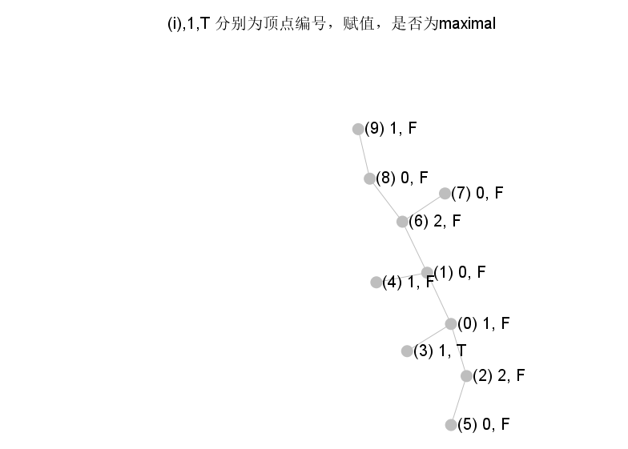

# model 文件夹的说明
用于存放调用gurobi的ILP模型以及对应求解问题的自编代码
> 以perfectDoubleRomanDomination为例，文件夹内包含
> 1. ILP文件求解任意图上的控制数。
>  -  其中 *_DrwaingOnGraph.java是可以直接在图上显示gurobi计算结果
> 2. 设计的某个DP程序求解树上的控制数。

、
# gurobi Java API 概述 
[原文出处](https://www.gurobi.com/documentation/9.5/refman/java_api_overview.html)

