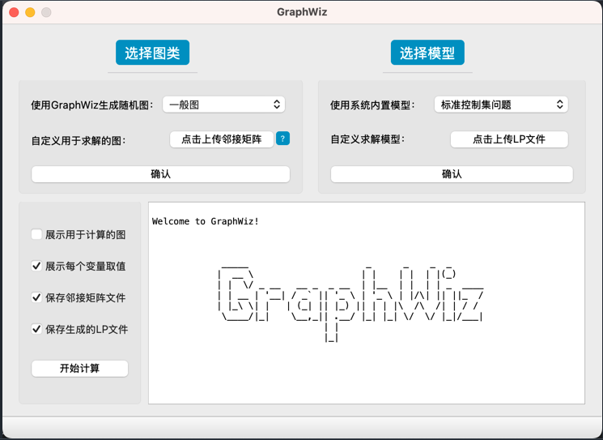

## 

## 功能
- 生成图：目前可以生成一般图、二部图、树、网格图、区间图、仙人掌图、块图等，生成的图可以用于项目内部计算，也可以保存邻接矩阵文件。
- 上传图的邻接矩阵文件用于计算。
- 上传LP文件求解图的一些问题。
- 使用项目内的模型进行计算，目前可以求解标准控制集问题、独立集问题、顶点覆盖问题、完美双罗马控制集问题，模型可以保存为LP文件。
- 展示计算结果：最优解、每个变量的取值