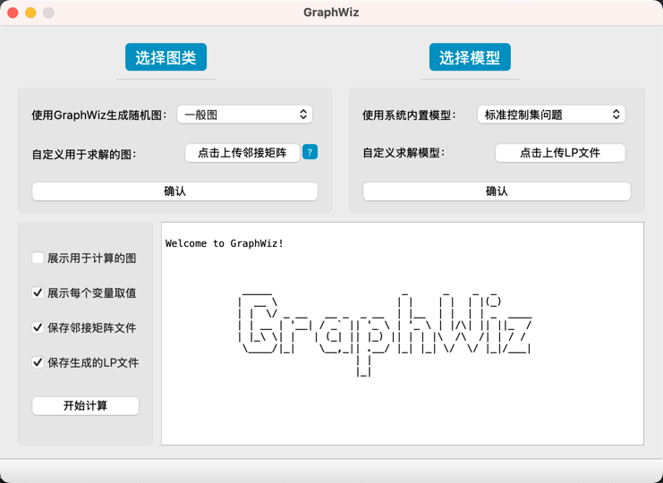
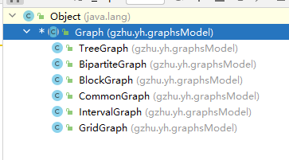
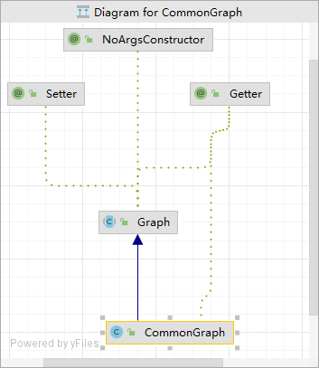

# 1. 项目介绍
使用gurobi的整数规划运算，调用gurobi的ILP模型求解计算图上的控制数等组合优化问题。目的是让gurobi的解与自己设计的算法进行正确性与性能的对比。origin版本为kelinkong/GraphWiz。
该版本采用c++与qt进行开发，拥有一个简洁的界面，源码库见[点击这里](https://github.com/kelinkong/GraphWiz)。qt界面如下：
## 功能
- 生成图：目前可以生成一般图、二部图、树、网格图、区间图、仙人掌图、块图等，生成的图可以用于项目内部计算，也可以保存邻接矩阵文件。
- 上传图的邻接矩阵文件用于计算。
- 上传LP文件求解图的一些问题。
- 使用项目内的模型进行计算，目前可以求解标准控制集问题、独立集问题、顶点覆盖问题、完美双罗马控制集问题，模型可以保存为LP文件。
- 展示计算结果：最优解、每个变量的取值
- 

# 2. 本分支版本的介绍
本项目分支基于**kelinkong/GraphWiz**进行重构与修改。是一个基于java 与 gurobi 的图计算工具，支持生成图、设计LP文件求解图的一些问题、使用项目内的模型进行计算、展示计算结果等功能。
## 2.1 功能
- 生成图：目前可以随机生成设定顶点数的一般图、二部图、树、网格图、区间图、块图、树等。
- gurobi求解：调用java版的api设计待求解问题的Gurobi的调用文件。可参考在src/main/java/gzhu/yh/model/ILP_MDRD.java。
- 算法正确性验证与性能对比。 
- 展示生成图、计算结果（最优解、每个变量的取值）。

## 2.2 目录结构
```
├─src
│  ├─main
│  │  ├─java
│  │  │  └─gzhu
│  │  │      └─yh
│  │  │          ├─graphDrawing //绘图：调用GraphStream、JGraphX绘制图
│  │  │          ├─graphsModel //图模型：生成图、保存图的邻接矩阵文件 （*必看*）
│  │  │          ├─gurobiLicense //gurobi的licesnse文件(非必选，本地安装gurobi后不用折腾license)
│  │  │          ├─logger //日志文件夹
│  │  │          ├─model //模型：生成模型、保存模型的LP文件. 算法：求解模型、展示计算结果
│  │  │          │  ├─independentRoman2Domination
│  │  │          │  ├─maximalRomanDomination //此处提供可运行的例子，参考ILP_MDRD_Modify_DrawingOnGraph.java  （*必看*）
│  │  │          │  └─perfectDoubleRomanDomiantion
│  │  │          └─util //保存工具类
│  │  │          └─Main.java //里面有主函数以及调用 （*必看*）
│  │  └─resources
│  └─test //测试文件夹
│      └─java
│          ├─callGurobi 
│          ├─drawingGraph
│          ├─functionTest
│          └─nativeMethodUse
│              ├─gurobiLicense
│              └─nativeMethodUse
├─target    
├─.gitignore
├─pom.xml //maven配置文件  （*必看*）
└─read.md //本文件

```
## 2.3 一些继承关系




# 3. 使用说明：

## 3.1 安装要求
- java1.8及其以上版本
- maven
- gurobi 10.0.3

## 3.2 入门指南
- 进入src/main/java/gzhu/yh/Main.md 运行psvm()函数
- 运行
`其他说明：`
- 在src/main/java/gzhu/yh/graphsModel/中设计所需的图模型
- 在src/main/java/gzhu/yh/model/中设计所需的模型和算法
  可参考src/main/java/gzhu/yh/model/ILP_MDRD_Modify_DrawingOnGraph.java（*入门必看*）


